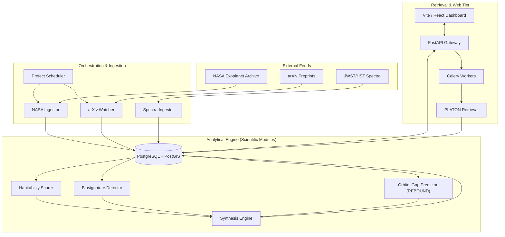
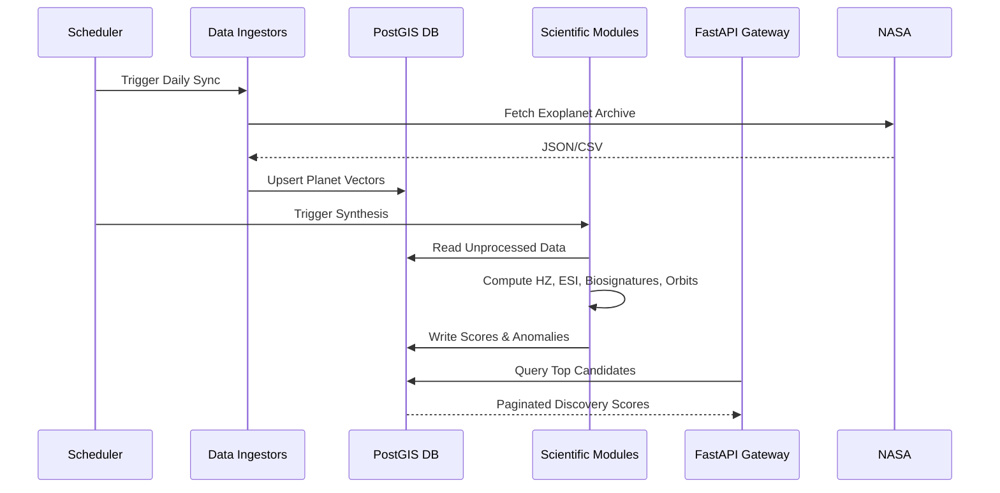

# Exoplanet Discovery Platform

## 🔭 TL;DR for Researchers
The **Exoplanet Discovery Platform** is an end-to-end automated pipeline and analytical engine designed to bridge the gap between raw astronomical data and actionable target selection. 

Instead of manually querying disparate databases, researchers can use this platform to:
1. **Identify high-priority targets** using a rigorously weighted Habitability and Discovery scoring matrix.
2. **Predict unobserved orbital companions** in resonant chains via automated $N$-body simulations (`rebound`).
3. **Execute atmospheric retrievals** on transmission spectra using Bayesian inference (`PLATON`, `dynesty`) on-demand.
4. **Access a unified API & Interactive 3D Interface** aggregating live data from the NASA Exoplanet Archive and recent arXiv preprints.

---

## 📊 Data Sources & Validation
The platform is built on continuous ingestion from trusted scientific repositories:
*   **Kinematic & Physical Data:** [NASA Exoplanet Archive](https://exoplanetarchive.ipac.caltech.edu/) (Daily sync).
*   **Literature & Preprints:** [arXiv Astro-ph](https://arxiv.org/archive/astro-ph) (NLP-based extraction of preliminary findings).
*   **Spectroscopy:** JWST / HST transmission spectra ingestion.
*   **Line Lists:** HITRAN and ExoMol databases for molecular cross-correlation.

---

## 🧮 Scientific Methodologies & Scoring Models

The platform evaluates planets via a two-track scoring system that explicitly separates Earth-similarity from environmental risk, mitigating the common flaw of over-ranking dangerous M-dwarf planets.

### 1. Earth Similarity Index (ESI)
A standard geometric mean of physical parameters (Schulze-Makuch et al. 2011).

$$ \text{ESI} = \prod_{i=1}^{n} \left( 1 - \left| \frac{x_i - x_0}{x_i + x_0} \right| \right)^{\frac{w_i}{n}} $$

Where $x_0$ is the Earth reference, and $w_i$ is the weight exponent:
*   **Radius ($w=0.57$)**, **Bulk Density ($w=1.07$)**, **Escape Velocity ($w=0.70$)**, **Surface Temp ($w=5.58$)**.

*Planetary equilibrium temperature ($T_{eq}$) assumes a Bond albedo ($A$) of 0.30.*

### 2. Environmental Risk Assessment
A novel framework penalizing conditions detrimental to habitability, particularly for targets in the habitable zones of active stars.

$$ \text{Risk Score} = (0.45 \times \text{Flare}) + (0.30 \times \text{Tidal Lock}) + (0.15 \times \text{Eccentricity}) + (0.10 \times \text{Age}) $$

### 3. Unified Discovery Score
The final ranking metric (0-100) synthesizes physical traits, data availability, and environmental context.

| Component | Max Points | Evaluation Criteria |
| :--- | :--- | :--- |
| **Habitability** | 40 | $(0.70 \times \text{ESI}_{similarity} + 0.30 \times \text{Risk}_{score}) \times 40$ |
| **Biosignatures** | 25 | Confirmed molecules $\times 5 \times (0.5 + 0.5 \times \frac{\sigma}{5})$ |
| **Data Quality** | 15 | Spectra available (5) + Instrument Tier (e.g., JWST=5) + Completeness (5) |
| **Orbital Context** | 10 | Co-planets ($\times 1.5$) + Predicted Gaps ($\times 2.0$) |
| **Anomaly Penalty** | -10 | $-\min(\text{Anomaly Count} \times 3.0, 10.0)$ |

$$ \text{Discovery Score} = \min(\max(H + B + D + O - A, 0), 100) $$

---

## ⚙️ Advanced Analytical Models
*   **N-Body Integration (`orbital_gap_predictor.py`)**: Utilizes the `rebound` IAS15 integrator to model planetary orbital stability and transit timing variations (TTVs) to infer hidden mass.
*   **Spectroscopic Cross-Correlation (`biosignature_detector.py`)**: Calculates the cross-correlation function (CCF) between high-resolution templates and observed spectra to derive molecular detection confidences ($\sigma$).
*   **Nested Sampling Retrieval (`platon_retrieval.py`)**: Employs `PLATON` and `dynesty` for fast forward modeling, retrieving atmospheric metallicity, C/O ratios, and cloud-top pressures.
*   **Unsupervised Anomaly Detection (`anomaly_detector.py`)**: Uses `HDBSCAN` clustering on multi-dimensional planetary parameter spaces to flag extreme statistical outliers.

---

## 🏗️ System Architecture & Dataflow

The platform operates as a modern microservices stack, easily reproducible via Docker.



### Automated Processing Dataflow




---

## 🚀 Quick Start / Reproducibility

To run the full stack locally for analysis or to contribute:

```bash
# 1. Clone the repository
git clone https://github.com/your-org/exo.git
cd exo

# 2. Start the database, cache, backend, and frontend
docker-compose up -d

# 3. Trigger the initial data ingestion
docker-compose exec api python modules/nasa_ingestor.py
docker-compose exec api python modules/habitability_scorer.py

# The API is now available at http://localhost:8000
# The interactive frontend is at http://localhost:5173
```
