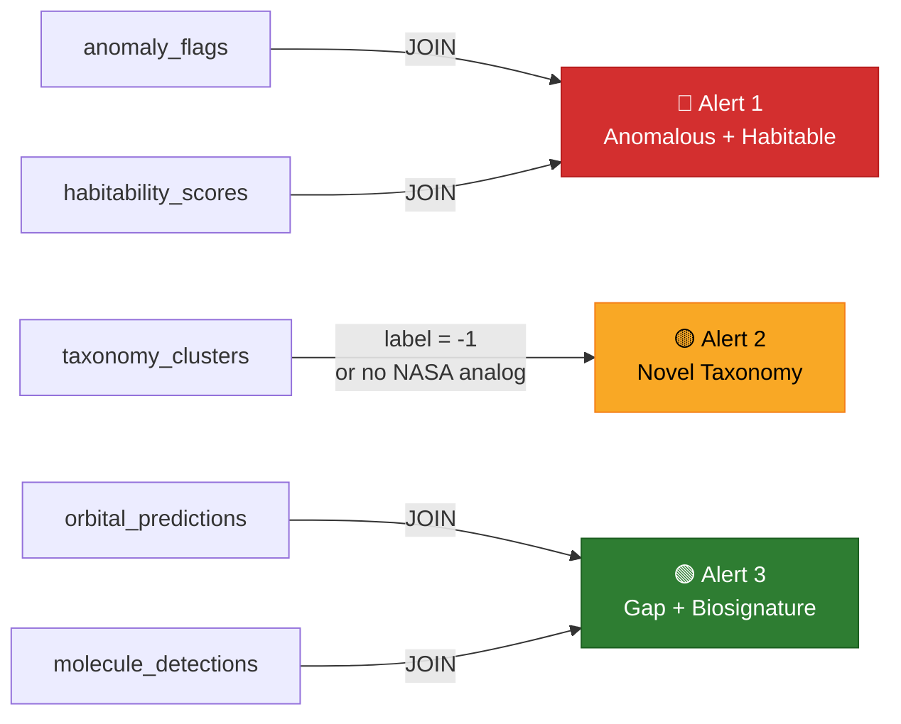
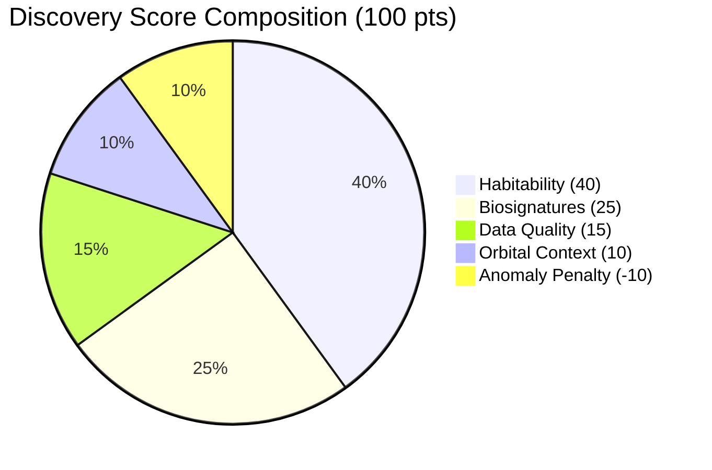
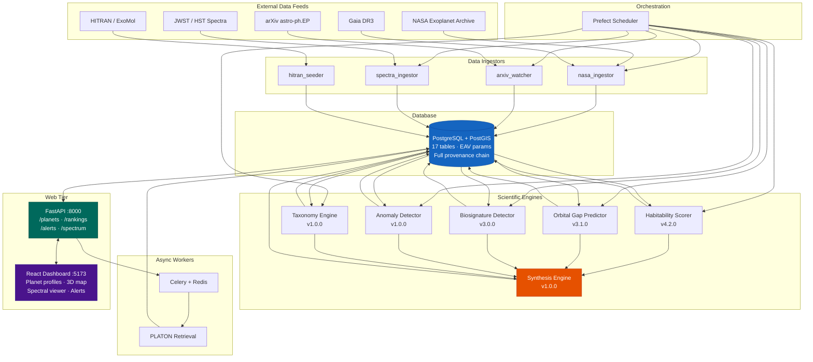

# Exo — Exoplanet Discovery Platform

> **6,224 confirmed worlds. Five analytical engines. One question: which planets are worth observing next?**

The NASA Exoplanet Archive has thousands of confirmed planets, each with dozens of measured parameters scattered across catalogs, papers, and instruments. But no single tool synthesizes all of these dimensions — habitability, atmospheric composition, orbital dynamics, anomalous properties — into a unified assessment.

**Exo does that.** It ingests the full archive nightly, runs five independent scientific modules against every planet, and produces a per-planet **Discovery Score (0–100)** that a researcher can use to prioritize telescope time. The outputs are served through a REST API and explored in an interactive React dashboard with 3D star maps, spectral viewers, and ranked target lists.

<br>

<p align="center">
  <code>docker-compose up -d</code> &nbsp;→&nbsp; <b>Full stack running in under 60 seconds</b>
</p>

<br>

---

## Table of Contents

- [Why This Exists](#-why-this-exists)
- [How It Works — The Five Engines](#-how-it-works--the-five-engines)
- [Discovery Score](#-discovery-score)
- [Data Sources](#-data-sources)
- [Architecture](#-architecture)
- [Quick Start](#-quick-start)
- [Project Map](#-project-map)
- [References](#-references)

---

## 🔍 Why This Exists

Existing tools each solve a piece of the problem but not the whole thing:

| Tool | What It Does | What It Misses |
|:---|:---|:---|
| **UPR Habitable Exoplanets Catalog** | Computes an Earth Similarity Index (ESI) | Ignores environmental hazards. An M-dwarf planet with ESI 0.95 ranks equally to one around a quiet G-dwarf — even though the M-dwarf's UV flares are probably stripping the atmosphere. |
| **REBOUND** | N-body orbital simulations | You set up each system manually, pick test particle positions, and interpret MEGNO values yourself. No automation across the full archive. |
| **HITRAN** | Molecular absorption line lists | Getting from raw transit depths to "H₂O detected at 3.2σ" requires continuum fitting, contamination checks, and abiotic reasoning — usually done ad-hoc in notebooks. |

Exo connects these tools into an automated pipeline. Each module writes to the same PostgreSQL database, and the **Synthesis Engine** joins their outputs to surface planets that are interesting across *multiple* scientific dimensions simultaneously.

---

## ⚙ How It Works — The Five Engines

Each engine is a standalone Python script that reads from and writes to the shared database. Run them individually or orchestrate with Prefect.

<br>

### Engine 1 · Habitability Scorer

> `modules/habitability_scorer.py` · v4.2.0

Scores every confirmed planet on **two tracks** — one measures how Earth-like the planet is physically, the other measures how dangerous its environment would be for life. Existing catalogs only do the first one.

<details>
<summary><b>Track 1 — Earth Similarity Index (ESI)</b> &nbsp;·&nbsp; <i>click to expand</i></summary>

<br>

Geometric mean of four physical parameters, following Schulze-Makuch et al. (2011):

$$\text{ESI} = \prod_{i=1}^{n} \left( 1 - \left| \frac{x_i - x_0}{x_i + x_0} \right| \right)^{w_i / n}$$

| Parameter | Earth Reference | Weight |
|:---|:---|---:|
| Radius | 1.0 R⊕ | 0.57 |
| Bulk Density | 1.0 ρ⊕ | 1.07 |
| Escape Velocity | 1.0 v⊕ | 0.70 |
| Equilibrium Temp | 255 K | 5.58 |

- Bulk density and escape velocity are derived from radius + mass when available.
- If only radius and temperature exist, the index computes with $n = 2$ (minimum 2 components, must include temperature).
- Implausible mass values (mass > 10 × R^2.5 — likely upper limits, not measurements) are treated as missing.

**Validation:** Pearson correlation against UPR's published ESI for 19 reference planets (TRAPPIST-1 e, Proxima Cen b, Kepler-442 b, etc.). Target: **r ≥ 0.70**.

</details>

<details>
<summary><b>Track 2 — Environmental Risk</b> &nbsp;·&nbsp; <i>click to expand</i></summary>

<br>

This is the platform's novel contribution. It penalizes conditions that undermine habitability even when physical parameters look Earth-like:

$$\text{Risk} = 0.45 \cdot \text{Flare} + 0.30 \cdot \text{Tidal} + 0.15 \cdot \text{Ecc} + 0.10 \cdot \text{Age}$$

| Factor | Weight | Logic |
|:---|---:|:---|
| **Flare activity** | 0.45 | Teff → flare risk lookup. M-dwarfs (< 3700 K) score 0.30 — they strip atmospheres. G-dwarfs peak at 1.0. Heaviest weight because atmosphere stripping is the primary failure mode for HZ planets around red dwarfs. |
| **Tidal locking** | 0.30 | Sigmoid of τ_lock ∝ a⁶/(M★² · R_p⁵). Close-in planets get penalized for permanent day/night split. |
| **Eccentricity** | 0.15 | exp(−2.057 · e²). High eccentricity → extreme seasonal temperature swings. |
| **Stellar age** | 0.10 | Inverse-sqrt activity proxy. Young stars are magnetically active. |

All sub-scores are floored at 0.2 — no single missing parameter can zero out the composite.

</details>

**Composite:** &ensp; `0.70 × similarity + 0.30 × risk`

The composite correlation against UPR is expected to be *lower* than the similarity-only correlation — that's the point. The risk track deliberately down-ranks M-dwarf planets that standard ESI overrates.

<br>

---

### Engine 2 · Orbital Gap Predictor

> `modules/orbital_gap_predictor.py` · v3.1.0

Scans every multi-planet system (≥ 2 confirmed planets) for dynamically stable gaps where additional planets could exist undetected.

<details>
<summary><b>Full methodology</b> &nbsp;·&nbsp; <i>click to expand</i></summary>

<br>

**Step 1 — Gap identification**
For every adjacent planet pair, compute mutual Hill radius separation Δ. Pairs with Δ > 18 R_H,m are anomalously wide (Gladman 1993 stability boundary).

**Step 2 — Test particle injection**
Five candidates per gap:
- 2:1, 3:2, 4:3 mean-motion resonances (inner)
- 1:2 MMR (outer)
- Geometric center √(a₁ · a₂)

Test mass: √(M_inner · M_outer), clamped to 0.5–2.0 M⊕.

**Step 3 — Analytical pre-filter**
Candidates with Δ < 10 R_H to either neighbor → rejected without integration.

**Step 4 — MEGNO stability (REBOUND)**

| Stage | Trials | Duration | Reject If |
|:---|---:|:---|:---|
| Fast screen | 5 | 5,000 orbits | MEGNO > 3.0 or ΔE/E > 10⁻⁴. Require ≥ 75% pass. |
| Deep validation | 20 | 50,000 orbits | e_max > 0.25 or Δa/a > 0.1. Require ≥ 80% pass to publish. |

**Step 5 — One prediction per gap.**
First stable resonance wins (MMRs first — physically motivated).

</details>

**Key design decisions:**
- `predicted_at` timestamps are **immutable** in the database — never overwritten on re-runs. This is the proof of prediction priority if a telescope later confirms the planet.
- All data fetched in **2 SQL queries** (not 1 per system). N-body work is parallelized via `ProcessPoolExecutor`. ~1,200 systems in **2–3 minutes** on 8 cores.

<br>

---

### Engine 3 · Biosignature Detector

> `modules/biosignature_detector.py` · v3.0.0

Compares transit/eclipse spectra against HITRAN molecular templates to identify atmospheric molecules.

**Target molecules:** &ensp; H₂O &nbsp;·&nbsp; CO₂ &nbsp;·&nbsp; O₃ &nbsp;·&nbsp; CH₄ &nbsp;·&nbsp; CO &nbsp;·&nbsp; NH₃ &nbsp;·&nbsp; SO₂

<details>
<summary><b>Detection pipeline (8 stages)</b> &nbsp;·&nbsp; <i>click to expand</i></summary>

<br>

| Stage | What It Does |
|:---|:---|
| **1. GP Continuum** | Gaussian Process regression (Matérn ν=1.5) trained on points *outside* known absorption bands. Models the spectral baseline without fitting the features. |
| **2. Spectral Unmixing** | All 7 molecular templates fit simultaneously via regularized OLS. Prevents misattribution when absorption bands overlap. Each molecule → coefficient β ± σ_β. |
| **3. Scale-Height Filter** | Expected max transit depth from planet gravity + star radius: Δ_max = 2R_p·H/R_s². Excess beyond 2× this → masked as systematic. |
| **4. Stellar Contamination** | M-dwarf hosts: H₂O penalized −0.5σ, CO −0.3σ. K-dwarfs: H₂O −0.3σ. Unocculted starspots mimic planetary absorption. |
| **5. Instrument Weighting** | JWST = 1.0×, HST = 0.85×, Spitzer = 0.70×, ground/unknown = 0.60×. |
| **6. Abiotic Reasoning** | CH₄ without CO₂ → −1.0σ. H₂O+CH₄+O₃ all ≥3σ → "triple biosignature" (abiotic unlikely). NH₃ on rocky → +0.5σ boost. SO₂ on rocky → volcanic flag. |
| **7. Multi-Epoch** | Detected in ≥2 independent spectra → +0.5σ. Only 1 of N spectra → −0.5σ. |
| **8. Classification** | ≥3σ + ≥3 HITRAN lines → **Tier 1 confirmed**. ≥2σ + ≥2 lines → **Tier 2 marginal**. |

</details>

**Validation:** `--validate` flag runs injection-recovery — synthetic signals at 1σ/2σ/3σ/5σ injected into real spectra, recovery rate measured, false positive rate from null injections.

<br>

---

### Engine 4 · Anomaly Detector

> `modules/anomaly_detector.py` · v1.0.0

Three detection engines running in parallel:

| Engine | What It Flags | Method |
|:---|:---|:---|
| **Mass-Radius Outliers** | Planets deviating >3σ from all Zeng et al. (2016) composition curves (pure iron, Earth-like, pure water) | Per-planet mass uncertainties from NASA archive. RV/TTV-measured masses get tighter error bars than transit-inferred masses (≥60% fractional error). Only R < 4 R⊕. |
| **Eccentricity-Period** | Short-period (P<10d) planets with e > 0.3 | Tidal circularization should make these nearly circular (expected e ≈ 0.05 ± 0.08). |
| **Density Outliers** | Density > 3σ from type-group mean | Four radius bins: Rocky (<1.5 R⊕), Sub-Neptune (<4), Neptune-class (<11), Giant. |

<br>

---

### Engine 5 · Taxonomy Engine

> `modules/taxonomy_engine.py` · v1.0.0

Unsupervised HDBSCAN clustering of the full catalog on five features:

```
radius · density · period · equilibrium temperature · semi-major axis
```

- Missing values imputed **per discovery-method group** (transit vs. RV vs. imaging have different selection biases — global imputation would mix populations).
- Period and semi-major axis log-transformed before StandardScaler.
- Clusters auto-named from centroid properties (e.g., "Hot Giant", "Temperate Rocky").
- Clusters with no NASA classification analog → flagged as **novel populations**.
- HDBSCAN noise points (label = −1) → truly unique planets that fit nothing.

<br>

---

### Engine 6 · Synthesis Engine

> `modules/synthesis_engine.py` · v1.0.0

Cross-module joins that surface planets interesting across *multiple* scientific dimensions:



---

## 📊 Discovery Score

Computed on-demand in the API (`api/main.py`) — not stored in the database, derived live from module outputs:



| Component | Max | Calculation |
|:---|---:|:---|
| **Habitability** | 40 | `composite_score × 40` |
| **Biosignatures** | 25 | confirmed_molecules × 5 × (0.5 + 0.5 × avg_σ/5), capped |
| **Data Quality** | 15 | spectra available (5) + instrument tier (JWST=5, HST=3.5, other=2) + completeness (5) |
| **Orbital Context** | 10 | sibling planets × 1.5 + predicted gaps × 2.0, capped |
| **Anomaly Penalty** | −10 | −min(anomaly_count × 3, 10) |

$$\text{Discovery Score} = \text{clamp}(H + B + D + O + A, \enspace 0, \enspace 100)$$

---

## 🌐 Data Sources

| Source | Ingests | Cadence |
|:---|:---|:---|
| [**NASA Exoplanet Archive**](https://exoplanetarchive.ipac.caltech.edu/) | Confirmed planets, stellar params, orbital elements (TAP API) | Nightly |
| [**arXiv astro-ph.EP**](https://arxiv.org/list/astro-ph.EP/recent) | Paper abstracts, regex-matched to known planets/stars | Daily |
| **NASA Spectroscopy Table** | Transit/eclipse depths from JWST, HST, Spitzer | Weekly |
| [**HITRAN**](https://hitran.org/) / **ExoMol** | Molecular line lists for spectral templates | Seeded once |
| **Gaia DR3** | Stellar ages (`age_flame`), luminosities | On new ingestion |

> **Why the arXiv watcher?** &ensp; arXiv posts papers the same day as submission. The NASA archive ingests the same data weeks to months later. Matching abstracts against our catalog keeps the platform more current than the archive alone.

---

## 🏗 Architecture



<details>
<summary><b>Database design notes</b></summary>

<br>

Parameters are stored in an **EAV (entity-attribute-value)** pattern — `planet_parameters` and `star_parameters` tables — with `is_default` flags and `valid_from`/`valid_to` timestamps.

When the NASA archive updates a planet's mass estimate, the old value is kept and marked non-default rather than overwritten. Every parameter row links back to an `ingestion_run` and optionally a `paper` for full provenance.

The `orbital_predictions.predicted_at` column is deliberately immutable — the timestamp is set once and never updated, so it constitutes proof of prediction priority relative to any later telescope confirmation.

</details>

---

## 🚀 Quick Start

```bash
# 1 — Clone
git clone https://github.com/yoohooshantanu/Exo.git && cd Exo

# 2 — Start the full stack (PostGIS, Redis, FastAPI, React)
docker-compose up -d

# 3 — Ingest the NASA archive (~2 min)
docker-compose exec api python pipe/nasa_ingestor.py

# 4 — Run the analytical engines
docker-compose exec api python modules/habitability_scorer.py
docker-compose exec api python modules/orbital_gap_predictor.py
docker-compose exec api python modules/biosignature_detector.py
docker-compose exec api python modules/anomaly_detector.py
docker-compose exec api python modules/taxonomy_engine.py
docker-compose exec api python modules/synthesis_engine.py
```

| Endpoint | URL |
|:---|:---|
| API docs (Swagger) | [`http://localhost:8000/docs`](http://localhost:8000/docs) |
| Interactive dashboard | [`http://localhost:5173`](http://localhost:5173) |

> **Tip:** Every module supports `--dry-run` to preview output without writing to the database.

---

## 📁 Project Map

```
Exo/
│
├── api/                            # REST API
│   ├── main.py                     # Routes + Discovery Score computation
│   ├── models.py                   # Pydantic response schemas
│   ├── queries.py                  # Raw SQL for all endpoints
│   └── db.py                       # Async SQLAlchemy session
│
├── db/                             # Database layer
│   ├── models.py                   # SQLAlchemy ORM — 17 tables
│   └── ingest_to_db.py             # Bulk CSV bootstrap ingestor
│
├── modules/                        # Scientific engines
│   ├── habitability_scorer.py      #  ↳ ESI + environmental risk scoring
│   ├── orbital_gap_predictor.py    #  ↳ Hill radius gaps + REBOUND N-body
│   ├── biosignature_detector.py    #  ↳ GP continuum + HITRAN matching
│   ├── anomaly_detector.py         #  ↳ Zeng curves, ecc/density outliers
│   ├── taxonomy_engine.py          #  ↳ HDBSCAN clustering
│   ├── synthesis_engine.py         #  ↳ Cross-module alert generation
│   ├── platon_retrieval.py         #  ↳ PLATON + dynesty retrieval
│   ├── spectra_ingestor.py         #  ↳ NASA spectroscopy ingestion
│   ├── hitran_seeder.py            #  ↳ HITRAN line list seeder
│   ├── exomol_seeder.py            #  ↳ ExoMol cross-sections
│   └── data_quality_filter.py      #  ↳ Pre-processing filters
│
├── pipe/                           # Orchestration
│   ├── nasa_ingestor.py            #  ↳ NASA TAP API ingestor
│   ├── arxiv_watcher.py            #  ↳ arXiv paper tracker
│   ├── scheduler.py                #  ↳ Prefect flows + cron schedules
│   ├── celery_worker.py            #  ↳ Async task runner
│   └── validation_suite.py         #  ↳ Data integrity checks
│
├── web/                            # React + Vite + TypeScript
├── alembic/                        # Database migrations
├── docker-compose.yml              # Full stack definition
└── requirements.txt                # Python 3.11+
```

---

## 📚 References

| Paper | Used In |
|:---|:---|
| Schulze-Makuch et al. (2011). *A Two-Tiered Approach to Assessing the Habitability of Exoplanets.* Astrobiology 11(10). | ESI formula + exponents |
| Gladman, B. (1993). *Dynamics of Systems of Two Close Planets.* Icarus 106(1), 247–263. | Hill radius stability boundary |
| Rein & Liu (2012). *REBOUND: An open-source multi-purpose N-body code.* A&A 537, A128. | N-body integrator |
| Rein & Tamayo (2015). *WHFAST: a fast and unbiased implementation of a symplectic Wisdom–Holman integrator.* MNRAS 452(1), 376–388. | MEGNO indicator |
| Zeng et al. (2016). *Mass–Radius Relation for Rocky Planet Interiors.* ApJ 819, 127. | Composition curves |
| Gordon et al. (2022). *The HITRAN2020 molecular spectroscopic database.* JQSRT 277, 107949. | Molecular line lists |
| Winn & Fabrycky (2015). *The Occurrence and Architecture of Exoplanetary Systems.* ARA&A 53. | Eccentricity benchmarks |

---

<p align="center">
  <sub>Built for the question that keeps astronomers up at night: <i>where should we point the telescope next?</i></sub>
</p>
